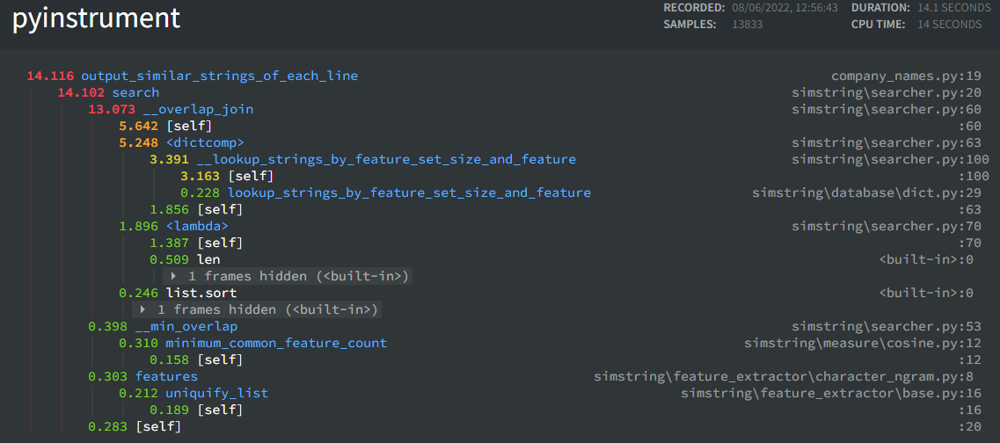
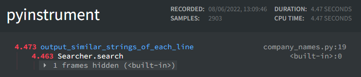

# Simstring


## Getting started

Install with `pip install simstring-fast`

```python
from simstring.feature_extractor import CharacterNgramFeatureExtractor
from simstring.measure import CosineMeasure
from simstring.database import DictDatabase
from simstring.searcher import Searcher

db = DictDatabase(CharacterNgramFeatureExtractor(2))
db.add('foo')
db.add('bar')
db.add('fooo')

searcher = Searcher(db, CosineMeasure())
results = searcher.search('foo', 0.8)
print(results)
```

## Simstring
The original method is described in this [paper](https://aclanthology.org/C10-1096.pdf). There is an even faster C++ implimentation by the original authors available [here](http://chokkan.org/software/simstring/)

This module is a fork of [this repo](https://github.com/nullnull/simstring) which is no longer actively maintained. This module adds documentation, speedups and more measures and features such saving compiled databases.

## Banchmarks

Without compilation the code takes 14 seconds to run through this particular banchmark, which is only on the data retrieval.


With compiltion this time is dropped to below 5 seconds.